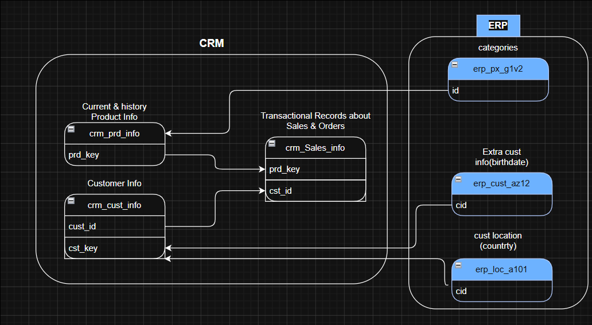
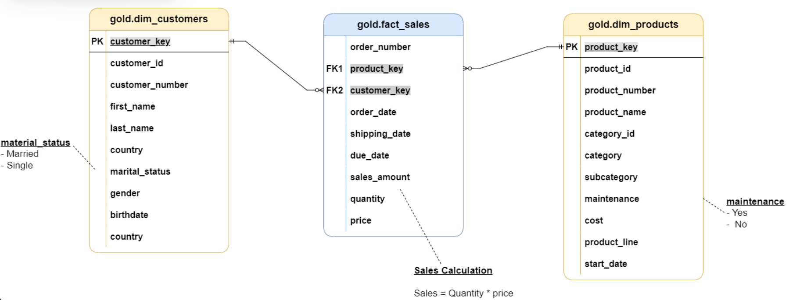

# SQL Data Warehouse & Analytics Project

## Overview

This project demonstrates the implementation of a modern Data Warehouse using SQL Server and the Medallion Architecture (Bronze, Silver, Gold). The solution integrates CRM and ERP data sources, builds ETL pipelines, and creates analytical data models for business reporting.

## Architecture

### Medallion Architecture

- Bronze Layer: Raw source data
- Silver Layer: Cleansed and transformed data
- Gold Layer: Business-ready analytical models

## Data Architecture

### Source Systems

#### CRM
- Customer Information
- Product Information
- Sales Transactions

#### ERP
- Product Categories
- Customer Demographics
- Customer Locations

## Data Model

## Technologies Used

- SQL Server
- T-SQL
- ETL
- Data Warehousing
- Star Schema
- Stored Procedures
- Views
- Git & GitHub

## ETL Workflow

1. Extract CRM and ERP data
2. Load data into Bronze Layer
3. Transform and cleanse in Silver Layer
4. Build analytical models in Gold Layer
5. Perform reporting and analytics

